

<picture>
  <source media="(prefers-color-scheme: dark)" srcset="brand-kit/NamiLogoFull/Nami_LogoFull_Gradient.svg">
  
</picture>

# Media Kit

**The official assets and guidelines for representing Nami** across publications,
integrations, campaigns, events, and partnership materials.

[Docs](https://docs.nami.fi) · [Telegram](https://t.me/namidefi) · [X](https://x.com/namidefi) · [Discord](https://discord.gg/namidefi)

Use the files included in the official Media Kit to ensure visual consistency across every
application.

> [!NOTE]
> Use **`Nami`** when referring to the brand, company, ecosystem, or protocol.
> Reserve **`NAMI`** for references to the token.

<picture>
  <source media="(prefers-color-scheme: dark)" srcset="_/naming-dark.svg">
  
</picture>

## Contents

| Section | What's inside |
|---|---|
| [Logo System](#logo-system) | Wordmark, symbol, and monochrome variants |
| [Clear Space and Minimum Size](#clear-space-and-minimum-size) | Spacing and reproduction limits |
| [Incorrect Usage](#incorrect-usage) | What to avoid |
| [Partnership Applications](#partnership-applications) | Co-branding rules |
| [Color Palette](#color-palette) | Official colors and the brand gradient |
| [Typography](#typography) | Satoshi specimen |
| [Approved Brand Descriptions](#approved-brand-descriptions) | Copy blocks for editorial use |
| [Brand Asset Usage](#brand-asset-usage) | Permissions and contact |
| [Asset Index](#asset-index) | Every file in this repository |

---

## Logo System

The Nami logo system includes the primary wordmark, the brand symbol, and monochrome variants
for different backgrounds and formats.

### Primary Logo

The symbol may be used independently in compact formats, including profile images, application
icons, interface elements, and placements where the full wordmark would be difficult to
reproduce clearly.

**Horizontal lockup** is the default. Use it wherever the layout gives the logo room to breathe.

<table>
<tr>
<td align="center" width="33%">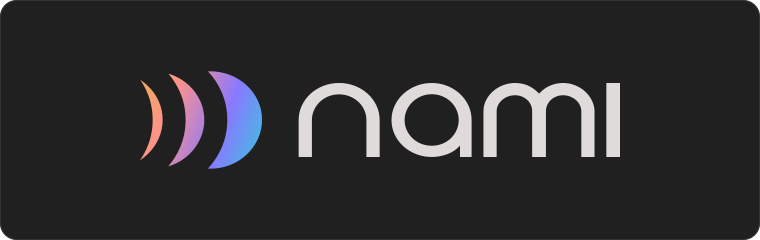</td>
<td align="center" width="33%">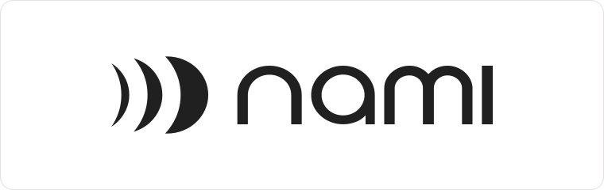</td>
<td align="center" width="33%">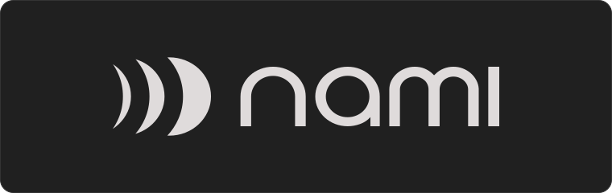</td>
</tr>
<tr>
<td align="center"><b>Gradient</b> Primary, dark backgrounds <a href="brand-kit/NamiLogoFull/Nami_LogoFull_Gradient.svg">SVG</a> · <a href="brand-kit/NamiLogoFull/Nami_LogoFull_Gradient.png">PNG</a></td>
<td align="center"><b>Black</b> Light backgrounds <a href="brand-kit/NamiLogoFull/Nami_LogoFull_Black.svg">SVG</a> · <a href="brand-kit/NamiLogoFull/Nami_LogoFull_Black.png">PNG</a></td>
<td align="center"><b>White</b> Dark backgrounds <a href="brand-kit/NamiLogoFull/Nami_LogoFull_White.svg">SVG</a> · <a href="brand-kit/NamiLogoFull/Nami_LogoFull_White.png">PNG</a></td>
</tr>
</table>

> [!WARNING]
> The gradient **lockups** draw the wordmark in Nami Light `#DFDBDB`, so they are dark-background
> assets. On a white page the wordmark all but disappears. Use the black lockup on light
> backgrounds. The gradient **symbol** contains no light-colored parts and works on either.

**Vertical lockup** is for narrow, centered, or square placements.

<table>
<tr>
<td align="center" width="33%">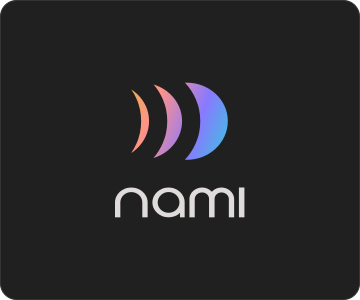</td>
<td align="center" width="33%">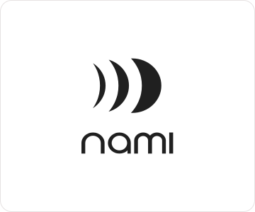</td>
<td align="center" width="33%">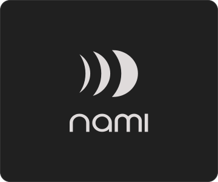</td>
</tr>
<tr>
<td align="center"><b>Gradient</b> <a href="brand-kit/NamiLogoFull/Nami_Logo_Vertical_Gradient.svg">SVG</a> · <a href="brand-kit/NamiLogoFull/Nami_Logo_Vertical_Gradient.png">PNG</a></td>
<td align="center"><b>Black</b> <a href="brand-kit/NamiLogoFull/Nami_Logo_Vertical_Black.svg">SVG</a> · <a href="brand-kit/NamiLogoFull/Nami_Logo_Vertical_Black.png">PNG</a></td>
<td align="center"><b>White</b> <a href="brand-kit/NamiLogoFull/Nami_Logo_Vertical_White.svg">SVG</a> · <a href="brand-kit/NamiLogoFull/Nami_Logo_Vertical_White.png">PNG</a></td>
</tr>
</table>

**Symbol** is for profile images, app icons, favicons, and other compact formats.

<table>
<tr>
<td align="center" width="33%">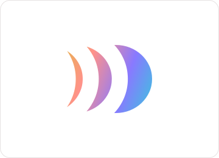</td>
<td align="center" width="33%">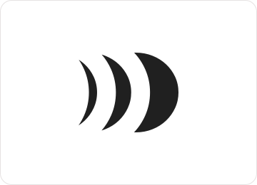</td>
<td align="center" width="33%">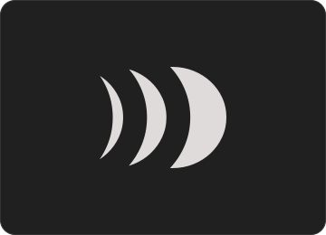</td>
</tr>
<tr>
<td align="center"><b>Gradient</b> <a href="brand-kit/NamiMark/Nami_Mark_Gradient.svg">SVG</a> · <a href="brand-kit/NamiMark/Nami_Mark_Gradient.png">PNG</a></td>
<td align="center"><b>Black</b> <a href="brand-kit/NamiMark/Nami_Mark_Black.svg">SVG</a> · <a href="brand-kit/NamiMark/Nami_Mark_Black.png">PNG</a></td>
<td align="center"><b>White</b> <a href="brand-kit/NamiMark/Nami_Mark_White.svg">SVG</a> · <a href="brand-kit/NamiMark/Nami_Mark_White.png">PNG</a></td>
</tr>
</table>

### Monochrome Versions

Use the supplied monochrome versions when the primary logo does not provide sufficient contrast
or when the format requires a single-color asset.

The monochrome files are not pure black and white. They are drawn in the brand neutrals:

| Variant | Color | Use on |
|---|---|---|
| Black |  `#202020` Nami Black | Light or light-tinted backgrounds |
| White |  `#DFDBDB` Nami Light | Dark or photographic backgrounds |

Always use the official files without altering their proportions, composition, or colors.

## Clear Space and Minimum Size

Maintain the specified clear space around the logo to preserve its visibility and separation
from surrounding elements.

The logo and symbol should remain above the minimum reproduction sizes indicated below.

<table>
<tr>
<td align="center" width="50%">
<picture>
  <source media="(prefers-color-scheme: dark)" srcset="_/clearspace-full-dark.svg">
  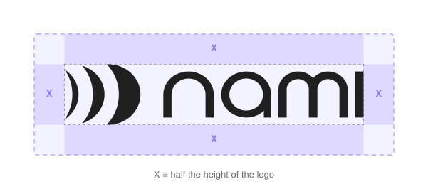
</picture>
</td>
<td align="center" width="50%">
<picture>
  <source media="(prefers-color-scheme: dark)" srcset="_/clearspace-mark-dark.svg">
  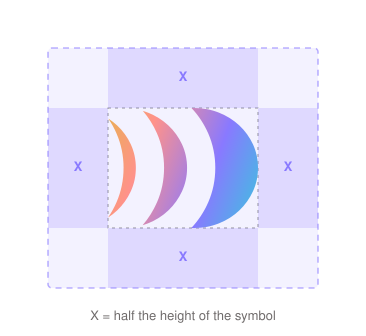
</picture>
</td>
</tr>
<tr>
<td align="center">Horizontal logo: <b>X</b> = half the logo height</td>
<td align="center">Symbol: <b>X</b> = half the symbol height</td>
</tr>
</table>

Keep all other elements (type, imagery, edges of the canvas, and other logos) outside the
shaded band.

<picture>
  <source media="(prefers-color-scheme: dark)" srcset="_/min-size-dark.svg">
  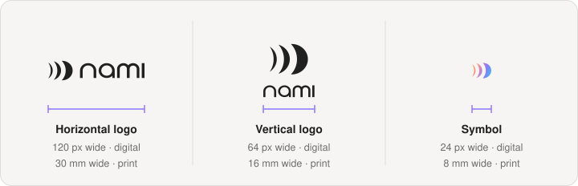
</picture>

Below these sizes, use the symbol on its own rather than a lockup.

> [!IMPORTANT]
> The published docs page states that clear space and minimum sizes apply but does not yet list
> numeric values. The figures above are working defaults derived from the asset geometry.
> Confirm them with the Nami team before external distribution.

## Incorrect Usage

Preserve the original appearance of every Nami brand asset.

<picture>
  <source media="(prefers-color-scheme: dark)" srcset="_/misuse-dark.svg">
  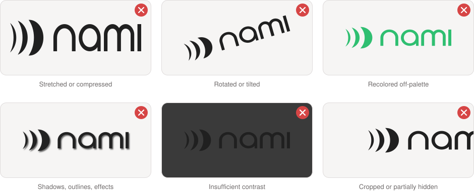
</picture>

Avoid:

- stretching, compressing, rotating, or cropping the logo;
- changing its colors or internal spacing;
- rearranging the symbol and wordmark;
- adding shadows, outlines, gradients, or other effects;
- placing the logo on backgrounds with insufficient contrast;
- incorporating the logo into another brand, product, or token;
- using outdated or recreated versions of the assets.

## Partnership Applications

When displaying Nami alongside another organization:

- give each logo comparable visual prominence;
- preserve the clear space required by both brands;
- align the logos according to their optical height;
- use a neutral separator where appropriate;
- keep each identity visually independent.

Combined partnership lockups should only be created using approved assets and layouts.

 Approved partnership lockup examples

## Color Palette

The official Nami color palette is provided below. Use the specified color values across
digital, printed, and promotional materials.

<picture>
  <source media="(prefers-color-scheme: dark)" srcset="_/palette-dark.svg">
  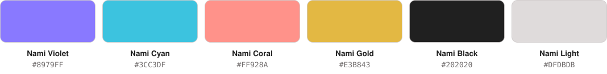
</picture>

| | Name | Hex | RGB |
|---|---|---|---|
|  | Nami Violet | `#8979FF` | `137, 121, 255` |
|  | Nami Cyan | `#3CC3DF` | `60, 195, 223` |
|  | Nami Coral | `#FF928A` | `255, 146, 138` |
|  | Nami Gold | `#E3B843` | `227, 184, 67` |
|  | Nami Black | `#202020` | `32, 32, 32` |
|  | Nami Light | `#DFDBDB` | `223, 219, 219` |

### Brand Gradient

The gradient logo files use a single diagonal gradient across four of the palette colors. Match
these stops when the gradient is reproduced in other media.

| Stop | Color | Hex |
|---|---|---|
| `0%` | Nami Gold | `#E3B843` |
| `31.7%` | Nami Coral | `#FF928A` |
| `68.3%` | Nami Violet | `#8979FF` |
| `100%` | Nami Cyan | `#3CC3DF` |

Values read directly from the official gradient assets. Do not rebuild the gradient by eye;
use the supplied SVG files.

## Typography

Nami's official typefaces support a consistent visual identity across interfaces,
communications, and marketing materials.

Use the designated primary typeface for headings and prominent brand applications. Use the
secondary typeface for body copy and information-dense formats where applicable.

<picture>
  <source media="(prefers-color-scheme: dark)" srcset="_/type-satoshi-dark.svg">
  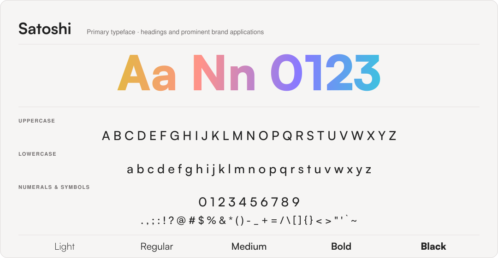
</picture>

Specimen set in Satoshi and converted to outlines, so it renders identically everywhere.
Satoshi is available from <a href="https://www.fontshare.com/fonts/satoshi">Fontshare</a>.
The published docs page names Satoshi as the primary typeface; a secondary typeface is
referenced but not yet specified.

## Approved Brand Descriptions

### Short Description

> Nami is a unified multichain DeFi protocol that coordinates trading, liquidity, lending, and
> governance across networks.

### Extended Description

> Nami is a unified multichain DeFi protocol designed to operate across networks as a single
> coordinated system. Its architecture connects trading, liquidity, lending, governance, and
> automation while coordinating markets, rewards, and user operations across supported chains.

## Brand Asset Usage

Nami brand assets may be used to reference the protocol accurately in editorial coverage,
research, integrations, listings, and approved partnership communications.

Their use must not imply an endorsement, sponsorship, partnership, or official affiliation that
has not been confirmed by Nami team.

For usage requests or brand-related questions, contact **[info@nami.fi](mailto:info@nami.fi)**.

## Asset Index

All files below are the official assets, unmodified, as shipped in
[nami.zip](https://docs.nami.fi/nami.zip).

| Asset | Variant | Vector | Raster | PNG size |
|---|---|---|---|---|
| Horizontal logo | Gradient | [SVG](brand-kit/NamiLogoFull/Nami_LogoFull_Gradient.svg) | [PNG](brand-kit/NamiLogoFull/Nami_LogoFull_Gradient.png) | 2208 × 448 |
| Horizontal logo | Black | [SVG](brand-kit/NamiLogoFull/Nami_LogoFull_Black.svg) | [PNG](brand-kit/NamiLogoFull/Nami_LogoFull_Black.png) | 2208 × 448 |
| Horizontal logo | White | [SVG](brand-kit/NamiLogoFull/Nami_LogoFull_White.svg) | [PNG](brand-kit/NamiLogoFull/Nami_LogoFull_White.png) | 2208 × 448 |
| Vertical logo | Gradient | [SVG](brand-kit/NamiLogoFull/Nami_Logo_Vertical_Gradient.svg) | [PNG](brand-kit/NamiLogoFull/Nami_Logo_Vertical_Gradient.png) | 554 × 576 |
| Vertical logo | Black | [SVG](brand-kit/NamiLogoFull/Nami_Logo_Vertical_Black.svg) | [PNG](brand-kit/NamiLogoFull/Nami_Logo_Vertical_Black.png) | 554 × 576 |
| Vertical logo | White | [SVG](brand-kit/NamiLogoFull/Nami_Logo_Vertical_White.svg) | [PNG](brand-kit/NamiLogoFull/Nami_Logo_Vertical_White.png) | 554 × 576 |
| Symbol | Gradient | [SVG](brand-kit/NamiMark/Nami_Mark_Gradient.svg) | [PNG](brand-kit/NamiMark/Nami_Mark_Gradient.png) | 600 × 480 |
| Symbol | Black | [SVG](brand-kit/NamiMark/Nami_Mark_Black.svg) | [PNG](brand-kit/NamiMark/Nami_Mark_Black.png) | 600 × 480 |
| Symbol | White | [SVG](brand-kit/NamiMark/Nami_Mark_White.svg) | [PNG](brand-kit/NamiMark/Nami_Mark_White.png) | 600 × 480 |

Prefer the SVG files wherever the medium allows. They stay sharp at any size and carry the
exact gradient.

Everything under [`brand-kit/`](brand-kit) is official and unmodified, with one exception:
[`_/`](_) holds the diagrams and specimens drawn for *this document*:
annotated, cropped, and deliberately distorted in places. Those are illustrations, not brand
assets; always reach for the files in the table above.

---

**[docs.nami.fi](https://docs.nami.fi)** · [Telegram](https://t.me/namidefi) · [X](https://x.com/namidefi) · [Discord](https://discord.gg/namidefi)

Mirrors <a href="https://docs.nami.fi/reference/resources/media-kit">docs.nami.fi/reference/resources/media-kit</a>.
Brand assets © Nami. Use is subject to the guidelines above.

